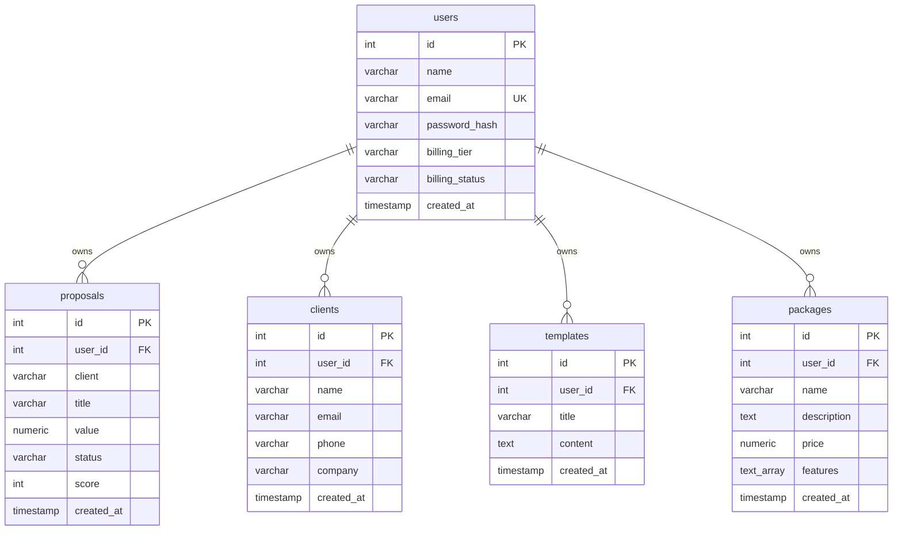

# ProposalPro PostgreSQL Database Schema

This document details the database schema configuration, table definitions, properties, indexes, and primary/foreign key mappings for the ProposalPro application database.

---

## Entity-Relationship Summary

---

## Tables Description

### 1. `users`
Represents application user account credentials and billing profiles.
- **id** (`SERIAL`): Primary key.
- **name** (`VARCHAR(50)`): Full name.
- **email** (`VARCHAR(100)`): Unique email, indexed.
- **password_hash** (`VARCHAR(255)`): Hashed user password.
- **billing_tier** (`VARCHAR(50)`): Default `'Free'` (Options: `'Free'`, `'Pro'`, `'Enterprise'`).
- **billing_status** (`VARCHAR(50)`): Default `'Active'`.
- **created_at** (`TIMESTAMP`): Creation time (without timezone).

### 2. `proposals`
Represents created proposal projects belonging to users.
- **id** (`SERIAL`): Primary key.
- **user_id** (`INTEGER`): Foreign key referencing `users.id` with `ON DELETE CASCADE`.
- **client** (`VARCHAR(255)`): Name of the client company.
- **title** (`VARCHAR(255)`): Title of the proposal.
- **value** (`NUMERIC(12, 2)`): Monetary value of the deal.
- **status** (`VARCHAR(50)`): Default `'Draft'` (Options: `'Draft'`, `'Review'`, `'Sent'`, `'Approved'`, `'Won'`).
- **score** (`INTEGER`): Proposal Win Score percentage (0 to 100).
- **created_at** (`TIMESTAMP`): Creation time (without timezone).

### 3. `clients`
Represents client directory entries created by users.
- **id** (`SERIAL`): Primary key.
- **user_id** (`INTEGER`): Foreign key referencing `users.id` with `ON DELETE CASCADE`.
- **name** (`VARCHAR(255)`): Primary contact name.
- **email** (`VARCHAR(255)`): Client email address.
- **phone** (`VARCHAR(50)`): Optional contact phone number.
- **company** (`VARCHAR(255)`): Client company name.
- **created_at** (`TIMESTAMP`): Creation time (without timezone).

### 4. `templates`
Represents reusable proposal templates created by users.
- **id** (`SERIAL`): Primary key.
- **user_id** (`INTEGER`): Foreign key referencing `users.id` with `ON DELETE CASCADE`.
- **title** (`VARCHAR(255)`): Template title name.
- **content** (`TEXT`): Rich text template content outline.
- **created_at** (`TIMESTAMP`): Creation time (without timezone).

### 5. `packages`
Represents agency pricing packages and service offerings.
- **id** (`SERIAL`): Primary key.
- **user_id** (`INTEGER`): Foreign key referencing `users.id` with `ON DELETE CASCADE`.
- **name** (`VARCHAR(255)`): Package name.
- **description** (`TEXT`): Package details.
- **price** (`NUMERIC(12, 2)`): Estimated base price of package.
- **features** (`TEXT[]`): Array of feature items included in package.
- **created_at** (`TIMESTAMP`): Creation time (without timezone).

### 6. `schema_migrations`
Metadata table used to keep track of database migrations.
- **id** (`SERIAL`): Primary key.
- **name** (`VARCHAR(255)`): Unique name of migration script.
- **executed_at** (`TIMESTAMP`): Execution timestamp.
